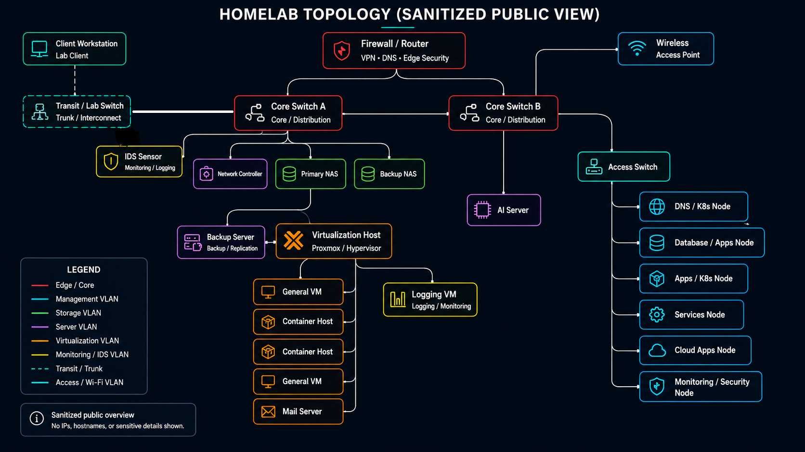

# Castellum Homelab Security Portfolio

A continuously developed cybersecurity and infrastructure homelab used to build hands-on experience with network security, Linux/Windows administration, SIEM, intrusion detection/prevention, virtualization, containerization, monitoring, automation, identity management, and backup/recovery.

The environment includes physical and virtual Linux/Windows systems, segmented VLANs, Docker workloads, Proxmox virtualization, OPNsense routing and firewalling, centralized security monitoring, and self-hosted applications.

## Architecture

## Areas of Focus

- Network segmentation and firewall policy
- SIEM and centralized logging
- IDS/IPS and network traffic analysis
- Linux administration and hardening
- Virtualization and containers
- Monitoring and alerting
- Security automation
- Identity and access management
- Backup and disaster recovery
- DNS and network services

## Documentation

- [Service Catalog](docs/service-catalog.md)
- [Network Architecture](docs/architecture/network-design.md)
- [VLAN Segmentation](docs/architecture/vlan-segmentation.md)

## Featured Security Projects

Documentation is being added incrementally as I work through the environment.

- Wazuh SIEM/XDR
- Graylog centralized logging
- Proxmox Virtualization
- OPNsense firewall. Suricata IDS/IPS, and VPN/WireGuard
- Traefik reverse proxy and edge security
- Security automation with n8n
- Linux hardening and compliance
