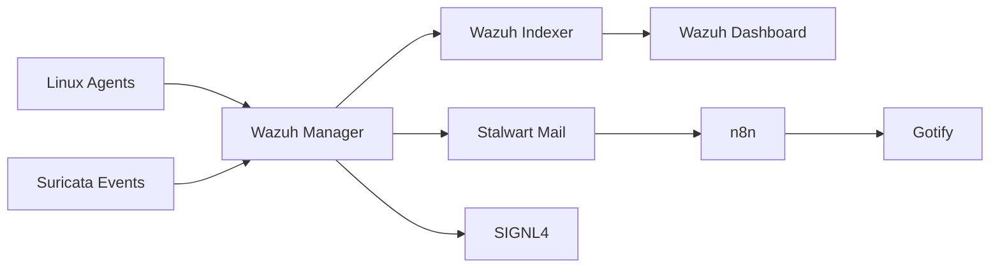

# Wazuh SIEM/XDR

## Objective

I deployed Wazuh to gain hands-on experience operating an open-source
SIEM/XDR platform in my continuously running homelab environment.

My goals were to centralize host security telemetry, monitor Linux and
Windows systems, integrate network-security events, develop and tune
custom detection rules, and gain practical experience investigating
alerts and reducing false-positive noise.

I chose a containerized Wazuh deployment because I was already building
experience with Docker and wanted the platform to be portable and easier
to maintain as the homelab evolved.

The deployment has changed significantly over time. The current platform
runs on Debian 13, while earlier versions of the deployment used Docker
named volumes before I later migrated persistent Wazuh data to dedicated
NVMe storage using bind mounts.

## Environment

- Debian 13 Linux host
- Docker / Docker Compose
- x86-64 hardware
- Dedicated NVMe storage for Wazuh persistent data
- Containerized Wazuh single-node deployment
- Linux and Windows Wazuh agents
- Network and host telemetry from multiple homelab systems

## Architecture



## Storage Design

As alert volume increased, I migrated Wazuh persistent data from Docker
named volumes to bind-mounted directories located on a dedicated NVMe
device.

The goal was to provide predictable storage placement, improve I/O
performance, and make the persistent data easier to identify and manage
outside Docker's internal volume directory structure.

## Security Configuration

- Host firewall policy restricts access to required Wazuh services.
- Wazuh agents are enrolled only from my local authorized homelab systems.
- Administrative access is restricted to internal management networks.
- Custom rules are used to tune detections for the environment.
- Security telemetry is centralized for correlation and investigation.

## Security Ecosystem and Integrations

- Graylog
- Suricata
- SIGNL4
- n8n
- Stalwart

## Problems Encountered

As the deployment evolved, I encountered several issues that required both infrastructure and application-level troubleshooting.

The most significant challenges included:

* Migrating Wazuh persistent data from Docker named volumes to bind-mounted directories on dedicated NVMe storage.
* Understanding how existing container data and bind-mounted directories affected Wazuh initialization.
* Developing custom XML rules and learning the importance of validating them with \`wazuh-analysisd -t\` before restarting the manager.
* Reducing large volumes of false-positive and low-value alerts.
* Configuring the Wazuh Docker listener correctly on Linux agents.
* Verifying that custom detections generated the expected alerts after configuration changes.

These issues gradually changed how I approach container persistence, configuration validation, and SIEM rule development.

## Troubleshooting Methodology

Troubleshooting Wazuh required working across several layers of the
deployment rather than treating every problem as an application failure.

I regularly used:

- Docker container logs to identify startup and runtime failures
- Wazuh manager logs to investigate agent and rule-processing problems
- `wazuh-analysisd -t` to validate rule syntax before restarting services
- `systemctl` and `journalctl` when troubleshooting Wazuh agents
- `grep` and `jq` to isolate relevant events from large log and alert files
- Docker inspection and filesystem tools when diagnosing persistent
  storage and mount issues
- Controlled test events to confirm that detections worked as intended

My troubleshooting process generally followed:

1. Reproduce or identify the failure.
2. Determine which component generated the error.
3. Examine the relevant container, agent, or Wazuh logs.
4. Make one configuration change at a time.
5. Validate configuration before restarting services.
6. Generate a controlled test event.
7. Confirm the expected alert was created.

## Resolution and Validation

### Custom Rule Failure

While developing custom rules, I initially made configuration changes and
restarted the manager without first validating the rule set.

An invalid rule configuration could prevent `analysisd` from starting
normally, which in turn affected the Wazuh API and dashboard.

I changed my workflow so that every modification to `local_rules.xml`
is validated before the manager is restarted:

```bash
docker exec -it single-node-wazuh.manager-1 \
  /var/ossec/bin/wazuh-analysisd -t
```

### Resolving Container Mount Errors

To clean up the directory before a container restart to prevent `cp` errors:

* `rm -rf single-node_wazuh_var_multigroups`

### Enabling Docker Monitoring on (Debian) Agent

To install the necessary library and configure the agent:

* `apt update`
* `apt install python3-docker`
* `python3 -c 'import docker; print(docker.__version__)'`
* `head -1 /var/ossec/wodles/docker/DockerListener`
* `nano /var/ossec/etc/ossec.conf`
* `systemctl restart wazuh-agent`
* `systemctl status wazuh-agent --no-pager`
* `grep -iE 'docker|error' /var/ossec/logs/ossec.log | tail -50`

### Testing Detection

To verify that the `docker-listener` is correctly capturing events:

* `docker exec code-server /bin/echo wazuh-exec-detection-test`
* The `jq` command was used to parse `alerts.json` and verify the specific rule IDs (87907/87908) were triggered.

### Alert Noise and False-Positive Reduction

One of the largest operational lessons from running Wazuh continuously
was that generating alerts is much easier than generating useful alerts.

At one point the environment was producing approximately 132,000
Docker-exec-related alerts per day. Other recurring traffic such as
SSDP, mDNS, and LLMNR also generated events that were technically valid
but not useful in the same security context.

Rather than disabling monitoring entirely, I developed more specific
local rules and suppression logic to reduce known benign activity while
preserving detections that were useful for investigation.

This reduced alert fatigue and made higher-value security events easier
to identify.

## Outcome

The Wazuh deployment is now a continuously operated component of my
homelab security environment.

The project progressed from a basic containerized SIEM deployment into
a platform that includes Linux and Windows agents, custom detection
rules, Docker monitoring, network-security telemetry, alert tuning, and
external notification and automation workflows.

Operating the platform over time has provided practical experience not
only with Wazuh itself, but also with the operational challenges involved
in maintaining a SIEM: storage growth, rule validation, false-positive
reduction, agent troubleshooting, and detection verification.

## Skills Demonstrated

- SIEM administration
- Linux administration
- Log analysis
- Detection engineering
- Network troubleshooting

## Lessons Learned

One of the most important lessons from this project was understanding
the difference between Docker named volumes and bind mounts.

When I originally began working with Docker, I understood persistence at
a functional level but did not yet fully understand how Docker managed
named volumes or how that affected migration and recovery.

Migrating Wazuh to dedicated NVMe storage forced me to work through those
differences directly. I now make storage location, persistence,
portability, backup, and recovery considerations part of the initial
design of containerized services rather than treating them as an
afterthought.
